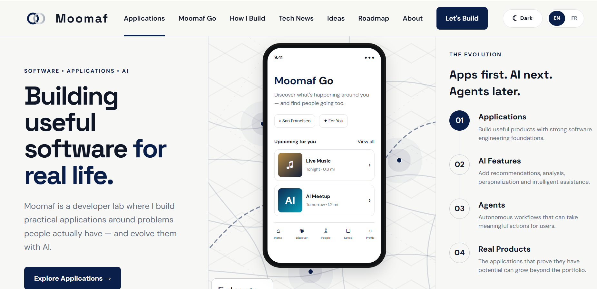
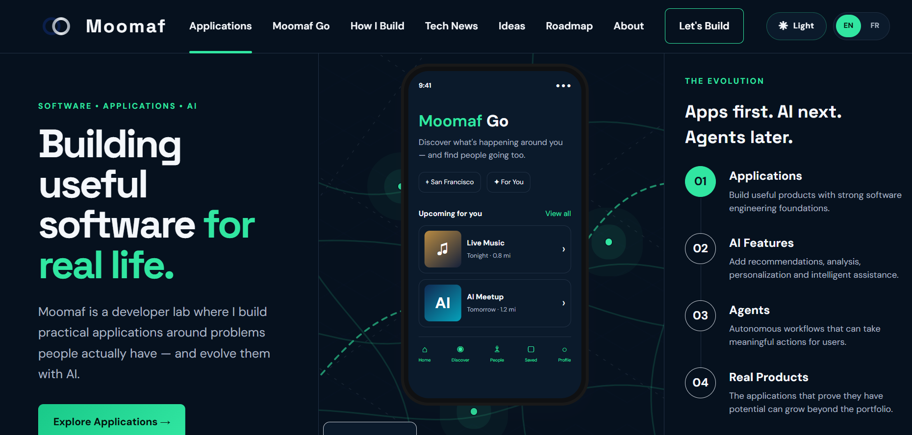

# Moomaf

**Building useful software for real life.**

Moomaf is a product and engineering lab where practical applications are built around real-world problems, then progressively enhanced with AI.

**Apps first. AI next. Agents later.**

Live site: https://moomaf.com

## Preview

### Light Mode

[](https://moomaf.com)

### Dark Mode

[](https://moomaf.com)

**[Visit Moomaf →](https://moomaf.com)**

---

## About

Moomaf is both a developer portfolio and a growing product lab.

The goal is to build useful applications in public, strengthen software engineering skills, experiment with AI where it genuinely improves the product, and eventually turn the strongest ideas into real products.

Current focus:

- practical web applications
- frontend and backend engineering
- APIs and integrations
- responsive UI/UX
- localization
- deployment
- AI-powered features
- future agentic workflows

---

## Current Applications

### Moomaf Go

A local discovery application for finding things to do nearby.

Long-term direction:

- personalized event discovery
- location-aware recommendations
- "who's going" social layer
- shared plans
- travel and itinerary assistance
- AI-powered recommendations

Initial launch focus: San Francisco / Bay Area.

### Moomaf Learn

A future education discovery product for:

- master's programs
- scholarships
- free courses
- certifications
- funding opportunities
- application guidance

### Moomaf Career

Planned tools for:

- job discovery
- resume assistance
- application tracking
- interview preparation

### Moomaf Save

A product idea focused on helping users compare prices, find deals, and discover cheaper alternatives.

### Moomaf Dev

A future collection of practical developer tools and utilities.

---

## Features in the Website

The current Moomaf website includes:

- responsive desktop and mobile design
- light and dark themes
- persistent theme preference
- English / French language toggle
- persistent language preference
- custom Moomaf logo and favicon
- Moomaf Go product preview
- product roadmap
- Tech News section
- community ideas / recommendations form
- authenticated SMTP submission flow
- responsive navigation
- GitHub and LinkedIn links

---

## Design System

### Light Mode

- soft off-white background
- navy typography and accents
- white cards
- silver borders and UI details

### Dark Mode

- deep navy background
- soft white typography
- silver secondary elements
- subtle teal / green highlights

The goal is to keep both themes visually consistent with the Moomaf identity instead of treating dark mode as a separate design.

---

## Tech Stack

### Frontend

- HTML5
- CSS3
- JavaScript
- responsive CSS
- CSS variables for theming
- localStorage for persistent theme and language settings

### Backend

- PHP
- authenticated SMTP for community idea submissions

### Hosting / Deployment

- IONOS
- GitHub for source control and project history

---

## Project Structure

```text
moomaf/
├── index.html
├── style.css
├── script.js
├── submit-idea.php
├── smtp-config.example.php
├── .gitignore
├── README.md
│
├── assets/
│   ├── logo.svg
│   └── favicon.svg
│
├── go/
│   └── index.html
│
└── tech-news/
    └── index.html
```

---

## Local Setup

Clone the repository:

```bash
git clone https://github.com/mansfall/moomaf.git
cd moomaf
```

For the static frontend, you can open `index.html` directly or run a local development server.

Example with Python:

```bash
python -m http.server 8000
```

Then open:

```text
http://localhost:8000
```

---

## Email / SMTP Setup

The community ideas form submits through authenticated SMTP.

For security, **SMTP credentials are not stored in GitHub**.

The repository contains:

```text
smtp-config.example.php
```

Copy it on the server to:

```text
smtp-config.php
```

Then add the real mailbox credentials.

The active sender / inbox is:

```text
mo@moomaf.com
```

Important:

```text
smtp-config.php
```

is excluded through `.gitignore` and should never be committed.

---

## Security Notes

Never commit:

- passwords
- SMTP credentials
- API keys
- access tokens
- private configuration files

Before pushing changes, always review:

```bash
git status
git diff
```

---

## Roadmap

### 01 — Applications

Build useful products with strong engineering foundations.

### 02 — AI Features

Add recommendations, personalization, analysis, and intelligent assistance where they improve the user experience.

### 03 — Agents

Introduce autonomous workflows that can perform meaningful actions for users.

### 04 — Real Products

Turn the strongest applications into independent products.

---

## Building in Public

Moomaf is intentionally developed in public so the evolution of each product can be followed through commits, releases, and live deployments.

GitHub: https://github.com/mansfall/moomaf

LinkedIn: https://www.linkedin.com/in/13272/

Website: https://moomaf.com

---

## Development Philosophy

**Real Problems**  
Build around problems people actually have.

**Ship Simply**  
Start with the smallest useful version and improve it through iteration.

**Engineering First**  
Focus on maintainable software, APIs, data, authentication, deployment, and testing.

**AI That Helps**  
Use AI when it makes the product meaningfully better—not just because it is available.

---

## Status

Moomaf is actively being developed.

The website is the foundation. The next major product build is **Moomaf Go**.

---

## License

All rights reserved unless otherwise stated.

© 2026 Moomaf
